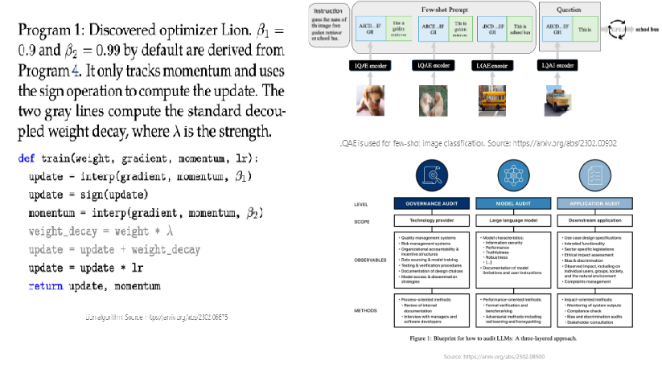
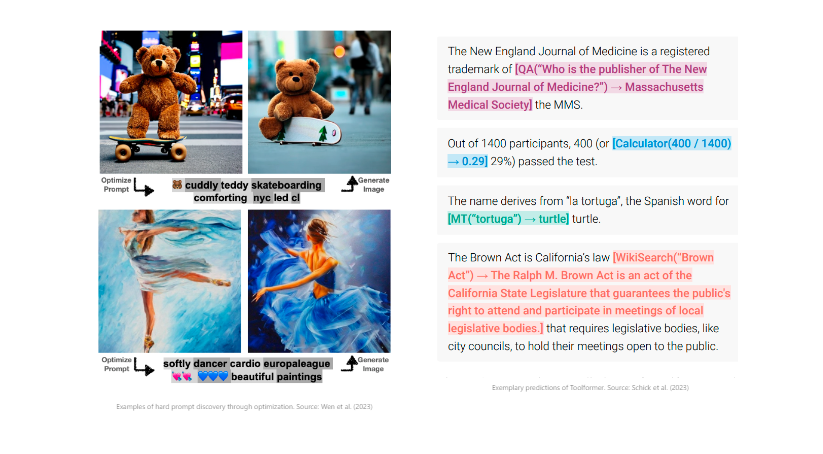
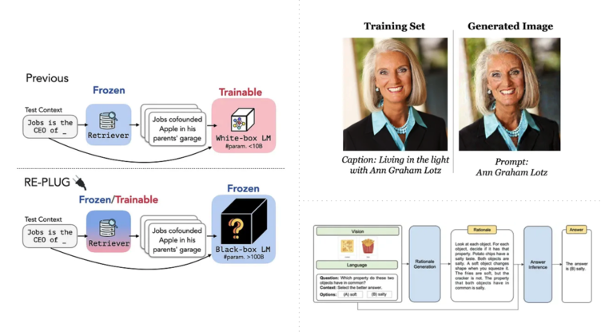
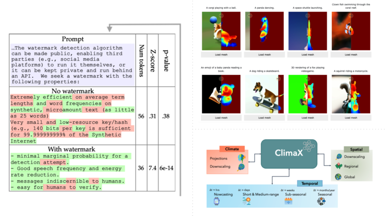
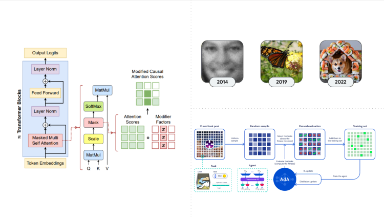
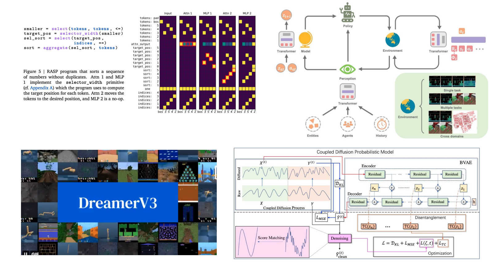
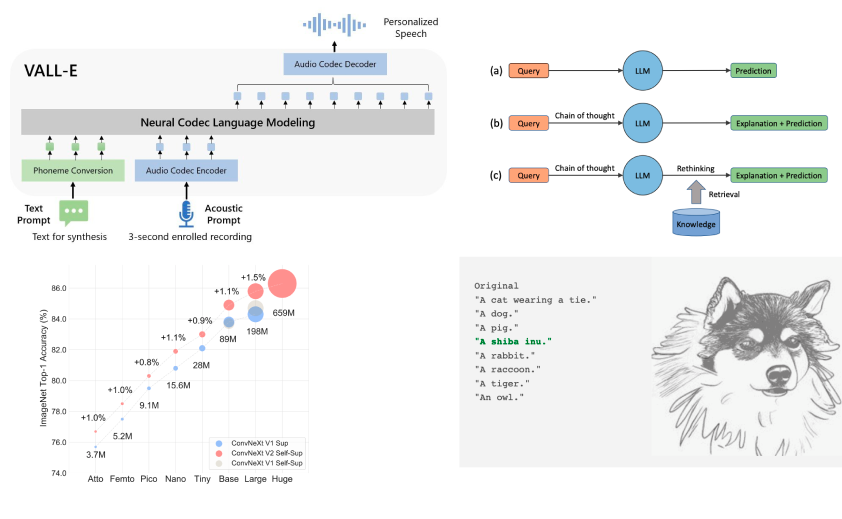

# **ML Papers of The Week**

We ❤️ reading ML papers so we've created this repo to highlight the top ML papers of every week.

[Follow us on Twitter](https://twitter.com/dair_ai) 

[Subscribe to our Substack Newsletter](https://nlpnews.substack.com/)

[Join our Discord](https://discord.gg/SKgkVT8BGJ)

## Top ML Papers of the Week (Feb 20-26)

| **Paper**  | **Links** |
| ------------- | ------------- |
| 1) **LLaMA: Open and Efficient Foundation Language Models** - LLaMA - a 65B parameter foundation model released by Meta AI; relies on publicly available data and outperforms GPT-3 on most benchmarks despite being 10x smaller.  | [Paper](https://research.facebook.com/publications/llama-open-and-efficient-foundation-language-models/), [Tweet](https://twitter.com/dair_ai/status/1629845535946420226?s=20)|
| 2) **Composer: Creative and Controllable Image Synthesis with Composable Conditions** - Composer - a 5B parameter creative and controllable diffusion model trained on billions (text, image) pairs.  | [Paper](https://arxiv.org/abs/2302.09778), [Project](https://damo-vilab.github.io/composer-page/) , [Github](https://github.com/damo-vilab/composer) , [Tweet](https://twitter.com/dair_ai/status/1629845537913548802?s=20) |
| 3) **The Wisdom of Hindsight Makes Language Models Better Instruction Followers** - Hindsight Instruction Relabeling - an alternative algorithm to train LLMs from feedback; the feedback is converted to instruction by relabeling the original one and training the model, in a supervised way, for better alignment. | [Paper](https://arxiv.org/abs/2302.05206), [Github](https://github.com/tianjunz/HIR) [Tweet](https://twitter.com/dair_ai/status/1629845539964481537?s=20) |
| 4) **Active Prompting with Chain-of-Thought for Large Language Models** - Active-Prompt - a prompting technique to adapt LLMs to different task-specific example prompts (annotated with human-designed chain-of-thought reasoning); this process involves finding where the LLM is most uncertain and annotating those.  | [Paper](https://arxiv.org/abs/2302.12246), [Code](https://github.com/shizhediao/active-prompt) [Tweet](https://twitter.com/dair_ai/status/1629845541847724033?s=20)  |
| 5. **Modular Deep Learning** - Modular Deep Learning - a survey offering a unified view of the building blocks of modular neural networks; it also includes a discussion about modularity in the context of scaling LMs, causal inference, and other key topics in ML. | [Paper](https://arxiv.org/abs/2302.11529) , [Project](https://www.ruder.io/modular-deep-learning/), [Tweet](https://twitter.com/dair_ai/status/1629845544037228551?s=20)
| 6) **Recitation-Augmented Language Models** - Recitation-Augmented LMs - an approach that recites passages from the LLM’s own memory to produce final answers; shows high performance on knowledge-intensive tasks.   | [Paper](https://arxiv.org/abs/2210.01296) , [Tweet](https://twitter.com/dair_ai/status/1629845546276995075?s=20)  |
| 7) **Learning Performance-Improving Code Edits** - LLMs to Optimize Code - an approach that uses LLMs to suggest functionally correct, performance-improving code edits. | [Paper](https://arxiv.org/abs/2302.07867), [Tweet](https://twitter.com/dair_ai/status/1629845548210561029?s=20)  |
| 8) **More than you've asked for: A Comprehensive Analysis of Novel Prompt Injection Threats to Application-Integrated Large Language Models** -  Prompt Injection Threats - a comprehensive analysis of novel prompt injection threats to application-integrated LLMs.  | [Paper](https://arxiv.org/abs/2302.12173), [Tweet](https://twitter.com/dair_ai/status/1629845550152523777?s=20)  |
| 9) **Aligning Text-to-Image Models using Human Feedback** - Aligning Text-to-Image Models using Human Feedback - proposes a fine-tuning method to align generative models using human feedback. | [Paper](https://arxiv.org/abs/2302.12192), [Tweet](https://twitter.com/dair_ai/status/1629845552039968780?s=20)  |
| 10) **MERF: Memory-Efficient Radiance Fields for Real-time View Synthesis in Unbounded Scenes** - MERF - a memory-efficient radiance field representation for real-time view synthesis of large-scale scenes in a browser. | [Paper](https://arxiv.org/abs/2302.12249), [Tweet](https://twitter.com/dair_ai/status/1629845554061606915?s=20)  |

## Top ML Papers of the Week (Feb 13 - 19)

| **Paper**  | **Links** |
| ------------- | ------------- |
| 1) **Symbolic Discovery of Optimization Algorithms** - Lion (EvoLved Sign Momentum) - a simple and effective optimization algorithm that’s more memory-efficient than Adam.   | [Paper](https://arxiv.org/abs/2302.06675), [Tweet](https://twitter.com/dair_ai/status/1627671313874575362?s=20)|
| 2) **Transformer models**: an introduction and catalog** - Transformer models: an introduction and catalog.  | [Paper](https://arxiv.org/abs/2302.07730), [Tweet](https://twitter.com/dair_ai/status/1627671315678126082?s=20) |
| 3) **3D-aware Conditional Image Synthesis** - pix2pix3D - a 3D-aware conditional generative model extended with neural radiance fields for controllable photorealistic image synthesis.| [Paper](xxx), [Project](https://www.cs.cmu.edu/~pix2pix3D/) [Tweet](https://twitter.com/dair_ai/status/1627671317355831296?s=20) |
| 4) **The Capacity for Moral Self-Correction in Large Language Models** - Moral Self-Correction in Large Language Models - finds strong evidence that language models trained with RLHF have the capacity for moral self-correction. The capability emerges at 22B model parameters and typically improves with scale.  | [Paper](https://arxiv.org/abs/2302.07459), [Tweet](https://twitter.com/dair_ai/status/1627671319100768260?s=20)  |
| 6) **Language Quantized AutoEncoders: Towards Unsupervised Text-Image Alignment** - Language Quantized AutoEncoders (LQAE) - an unsupervised method for text-image alignment that leverages pretrained language models; it enables few-shot image classification with LLMs.   | [Paper](https://arxiv.org/abs/2302.00902) , [Code](https://github.com/lhao499/lqae) [Tweet](https://twitter.com/haoliuhl/status/1625273748629901312?s=20)  |
| 7) **Augmented Language Models: a Survey** - Augmented Language Models - a survey of language models that are augmented with reasoning skills and the capability to use tools. | [Paper](https://arxiv.org/abs/2302.07842), [Tweet](https://twitter.com/dair_ai/status/1627671324477820929?s=20)  |
| 8) **Geometric Clifford Algebra Networks** -  Geometric Clifford Algebra Networks (GCANs) -  an approach to incorporate geometry-guided transformations into neural networks using geometric algebra.  | [Paper](https://arxiv.org/abs/2302.06594), [Tweet](https://twitter.com/dair_ai/status/1627671326176473088?s=20)  |
| 9) **Auditing large language models: a three-layered approach** - Auditing large language models - proposes a policy framework for auditing LLMs. | [Paper](https://arxiv.org/abs/2302.08500), [Tweet](https://twitter.com/dair_ai/status/1627671327950643200?s=20)  |
| 10) **Energy Transformer** - Energy Transformer - a transformer architecture that replaces the sequence of feedforward transformer blocks with a single large Associate Memory model; this follows the popularity that Hopfield Networks have gained in the field of ML. | [Paper](https://arxiv.org/abs/2302.07253), [Tweet](https://twitter.com/dair_ai/status/1627671329561346050?s=20)  |

## Top ML Papers of the Week (Feb 6 - 12)

| **Paper**  | **Links** |
| ------------- | ------------- |
| 1) **Toolformer: Language Models Can Teach Themselves to Use Tools** - Toolformer - introduces language models that teach themselves to use external tools via simple API calls.    | [Paper](https://arxiv.org/abs/2302.04761), [Tweet](https://twitter.com/dair_ai/status/1624832248691191808?s=20&t=ygX07dsAPDF8_jwrxZIo1Q)|
| 2) **Describe, Explain, Plan and Select: Interactive Planning with Large Language Models Enables Open-World Multi-Task Agents** - Describe, Explain, Plan, and Select - proposes using language models for open-world game playing.| [Paper](https://arxiv.org/abs/2302.01560), [Tweet](https://twitter.com/dair_ai/status/1624832250717036548?s=20&t=ygX07dsAPDF8_jwrxZIo1Q) |
| 3) **A Categorical Archive of ChatGPT Failures** - A Categorical Archive of ChatGPT Failures - a comprehensive analysis of ChatGPT failures for categories like reasoning, factual errors, maths, and coding. | [Paper](https://arxiv.org/abs/2302.03494), [Tweet](https://twitter.com/dair_ai/status/1624832252587700230?s=20&t=ygX07dsAPDF8_jwrxZIo1Q) |
| 4) **Hard Prompts Made Easy: Gradient-Based Discrete Optimization for Prompt Tuning and Discovery** - Hard Prompts Made Easy - optimizing hard text prompts through efficient gradient-based optimization.  | [Paper](https://arxiv.org/abs/2302.03668), [Tweet](https://twitter.com/dair_ai/status/1624832254588465156?s=20&t=ygX07dsAPDF8_jwrxZIo1Q)  |
| 5) **Data Selection for Language Models via Importance Resampling** - Data Selection for LMs - proposes a cheap and scalable data selection framework based on an importance resampling algorithm to improve the downstream performance of LMs. | [Paper](https://arxiv.org/abs/2302.03169), [Tweet](https://twitter.com/dair_ai/status/1624832256400302080?s=20&t=ygX07dsAPDF8_jwrxZIo1Q)  |
| 6) **Structure and Content-Guided Video Synthesis with Diffusion Models** - Gen-1 - proposes an approach for structure and content-guided video synthesis with diffusion models.   | [Paper](https://arxiv.org/abs/2302.03011) , [Project](https://research.runwayml.com/gen1), [Tweet](https://twitter.com/dair_ai/status/1624832258296229889?s=20&t=ygX07dsAPDF8_jwrxZIo1Q)  |
| 7) **A Multitask, Multilingual, Multimodal Evaluation of ChatGPT on Reasoning, Hallucination, and Interactivity** - Multitask, Multilingual, Multimodal Evaluation of ChatGPT - performs a more rigorous evaluation of ChatGPt on reasoning, hallucination, and interactivity. | [Paper](https://arxiv.org/abs/2302.04023), [Tweet](https://twitter.com/dair_ai/status/1624832260213026819?s=20&t=ygX07dsAPDF8_jwrxZIo1Q)  |
| 8) **Noise2Music: Text-conditioned Music Generation with Diffusion Models** -  Noise2Music - proposes diffusion models to generate high-quality 30-second music clips via text prompts.  | [Paper](https://arxiv.org/abs/2302.03917), [Project](https://google-research.github.io/noise2music/), [Tweet](https://twitter.com/dair_ai/status/1624832262163337220?s=20&t=ygX07dsAPDF8_jwrxZIo1Q)  |
| 9) **Offsite-Tuning: Transfer Learning without Full Model** - Offsite-Tuning - introduces an efficient, privacy-preserving transfer learning framework to adapt foundational models to downstream data without access to the full model. | [Paper](https://arxiv.org/abs/2302.04870), [Project](https://github.com/mit-han-lab/offsite-tuning), [Tweet](https://twitter.com/dair_ai/status/1624832264029831169?s=20&t=ygX07dsAPDF8_jwrxZIo1Q)  |
| 10) **Zero-shot Image-to-Image Translation** - pix2pix-zero - proposes a model for zero-shot image-to-image translation.  | [Paper](https://arxiv.org/abs/2302.03027), [Project](https://pix2pixzero.github.io/), [Tweet](https://twitter.com/dair_ai/status/1624832265967607813?s=20&t=ygX07dsAPDF8_jwrxZIo1Q)  |

---

## Top ML Papers of the Week (Jan 30-Feb 5)

| **Paper**  | **Links** |
| ------------- | ------------- |
| 1) **REPLUG: Retrieval-Augmented Black-Box Language Models** - REPLUG - a retrieval-augmented LM framework that adapts a retriever to a large-scale, black-box LM like GPT-3.     | [Paper](https://arxiv.org/abs/2301.12652), [Tweet](https://twitter.com/dair_ai/status/1622261780725616641?s=20&t=ygX07dsAPDF8_jwrxZIo1Q)|
| 2) **Extracting Training Data from Diffusion Models** - Extracting Training Data from Diffusion Models - shows that diffusion-based generative models can memorize images from the training data and emit them at generation time. | [Paper](https://arxiv.org/abs/2301.13188), [Tweet](https://twitter.com/dair_ai/status/1622261782738788353?s=20&t=ygX07dsAPDF8_jwrxZIo1Q) |
| 3) **The Flan Collection: Designing Data and Methods for Effective Instruction Tuning** - The FLAN Collection - release a more extensive publicly available collection of tasks, templates, and methods to advancing instruction-tuned models. | [Paper](https://arxiv.org/abs/2301.13688), [Tweet](https://twitter.com/dair_ai/status/1622261784668241922?s=20&t=ygX07dsAPDF8_jwrxZIo1Q) |
| 4) **Multimodal Chain-of-Thought Reasoning in Language Models** - Multimodal Chain-of-Though Reasoning - incorporates vision features to elicit chain-of-thought reasoning in multimodality, enabling the model to generate effective rationales that contribute to answer inference. | [Paper](https://arxiv.org/abs/2302.00923), [Code](https://github.com/amazon-science/mm-cot) [Tweet](https://twitter.com/dair_ai/status/1622261786559791105?s=20&t=ygX07dsAPDF8_jwrxZIo1Q)  |
| 5) **Dreamix: Video Diffusion Models are General Video Editors** - Dreamix - a diffusion model that performs text-based motion and appearance editing of general videos.  | [Paper](https://arxiv.org/abs/2302.01329), [Project](https://dreamix-video-editing.github.io/), [Tweet](https://twitter.com/dair_ai/status/1622261788497657856?s=20&t=ygX07dsAPDF8_jwrxZIo1Q)  |
| 6) **Benchmarking Large Language Models for News Summarization** - Benchmarking LLMs for news summarization.   | [Paper](https://arxiv.org/abs/2301.13848) , [Tweet](https://twitter.com/dair_ai/status/1622261790326259714?s=20&t=ygX07dsAPDF8_jwrxZIo1Q)  |
| 7) **Mathematical Capabilities of ChatGPT** - Mathematical Capabilities of ChatGPT - investigates the mathematical capabilities of ChatGPT on a new holistic benchmark called GHOSTS. | [Paper](https://arxiv.org/abs/2301.13867), [Tweet](https://twitter.com/dair_ai/status/1622261792238886913?s=20&t=ygX07dsAPDF8_jwrxZIo1Q)  |
| 8) **Emergence of Maps in the Memories of Blind Navigation Agents** - Training ‘Blind’ Agents - trains an AI agent to navigate purely by feeling its way around; no use of vision, audio, or any other sensing (as in animals).  | [Paper](https://arxiv.org/abs/2301.13261), [Project](https://wijmans.xyz/publication/eom/), [Tweet](https://twitter.com/dair_ai/status/1622261793987989507?s=20&t=ygX07dsAPDF8_jwrxZIo1Q)  |
| 9) **SceneDreamer: Unbounded 3D Scene Generation from 2D Image Collections** - SceneDreamer - a generative model that synthesizes large-scale 3D landscapes from random noises.  | [Paper](https://arxiv.org/abs/2302.01330), [Tweet](https://twitter.com/dair_ai/status/1622261795925671936?s=20&t=ygX07dsAPDF8_jwrxZIo1Q)  |
| 10) **Large Language Models Can Be Easily Distracted by Irrelevant Context** - LLMs and irrelevant context - finds that many prompting techniques fail when presented with irrelevant context for arithmetic reasoning.  | [Paper](https://arxiv.org/abs/2302.00093), [Tweet](https://twitter.com/dair_ai/status/1622261798379429888?s=20&t=ygX07dsAPDF8_jwrxZIo1Q)  |

---

## Top ML Papers of the Week (Jan 23-29)

| **Paper**  | **Links** |
| ------------- | ------------- |
| 1) **MusicLM: Generating Music From Text** - MusicLM - a generative model for generating high-fidelity music from text descriptions.    | [Paper](https://arxiv.org/abs/2301.11325), [Tweet](https://twitter.com/dair_ai/status/1619716425761042436?s=20&t=ygX07dsAPDF8_jwrxZIo1Q)|
| 2) **Hungry Hungry Hippos: Towards Language Modeling with State Space Models** - H3 - an approach to reduce the gap, in terms of performance and hardware utilization, between state space models and attention for language modeling. | [Paper](https://arxiv.org/abs/2212.14052), [Tweet](https://twitter.com/dair_ai/status/1619716427879174144?s=20&t=ygX07dsAPDF8_jwrxZIo1Q) |
| 3) **A Watermark for Large Language Models** - A Watermark for LLMs - a watermarking framework for proprietary language models. | [Paper](https://arxiv.org/abs/2301.10226), [Tweet](https://twitter.com/dair_ai/status/1619716430127308800?s=20&t=ygX07dsAPDF8_jwrxZIo1Q) |
| 4) **Text-To-4D Dynamic Scene Generation** - Make-A-Video3D - a new text-to-4D model for dynamic scene generation from input text.  | [Paper](https://arxiv.org/abs/2301.11280), [Github](https://make-a-video3d.github.io/), [Tweet](https://twitter.com/dair_ai/status/1619718845018828801?s=20&t=ygX07dsAPDF8_jwrxZIo1Q)  |
| 5) **ClimaX: A foundation model for weather and climate** - ClimaX - a foundation model for weather and climate, including many capabilities for atmospheric science tasks.| [Paper](https://arxiv.org/abs/2301.10343), [Tweet](https://twitter.com/tungnd_13/status/1618642574427959296?s=20&t=ygX07dsAPDF8_jwrxZIo1Q), [Blog](https://www.microsoft.com/en-us/research/group/autonomous-systems-group-robotics/articles/introducing-climax-the-first-foundation-model-for-weather-and-climate/)  |
| 6) **Open Problems in Applied Deep Learning** - If you're looking for interesting open problems in DL, this is a good reference. Not sure if intentional but it also looks useful to get a general picture of current trends in deep learning with ~300 references. | [Paper](https://arxiv.org/abs/2301.11316) , [Tweet](https://twitter.com/dair_ai/status/1619719063915339777?s=20&t=ygX07dsAPDF8_jwrxZIo1Q)  |
| 7) **DetectGPT: Zero-Shot Machine-Generated Text Detection using Probability Curvature** - DetectGPT - an approach for zero-shot machine-generated text detection. Uses raw log probabilities from the LLM to determine if the passage was sampled from it. | [Paper](https://arxiv.org/abs/2301.11305), [Tweet](https://twitter.com/dair_ai/status/1619719169758613504?s=20&t=ygX07dsAPDF8_jwrxZIo1Q)  |
| 8) **StyleGAN-T: Unlocking the Power of GANs for Fast Large-Scale Text-to-Image Synthesis** - StyleGAN-T - a new model that aims to regain the competitiveness of GANs for fast large-scale text-to-image synthesis.  | [Paper](https://arxiv.org/abs/2301.09515), [Project](https://sites.google.com/view/stylegan-t/), [Code](https://github.com/autonomousvision/stylegan-t) [Tweet](https://twitter.com/dair_ai/status/1619719293779976193?s=20&t=ygX07dsAPDF8_jwrxZIo1Q)  |
| 9) **StyleGAN-T: Unlocking the Power of GANs for Fast Large-Scale Text-to-Image Synthesis** - ProGen - an LLM that can generate protein sequences with a predictable function across large protein families.  | [Paper](https://www.nature.com/articles/s41587-022-01618-2), [Tweet](https://twitter.com/dair_ai/status/1619719404618645511?s=20&t=ygX07dsAPDF8_jwrxZIo1Q)  |
| 10) **The Impossibility of Parallelizing Boosting** - The Impossibility of Parallelizing Boosting - investigates the possibility of parallelizing boosting.  | [Paper](https://arxiv.org/abs/2301.09627), [Tweet](https://twitter.com/dair_ai/status/1619719511867015168?s=20&t=ygX07dsAPDF8_jwrxZIo1Q)  |

---

## Top ML Papers of the Week (Jan 16-22)

| **Paper**  | **Links** |
| ------------- | ------------- |
| 1) **Google AI Research Recap (2022 Edition)** - an excellent summary of some notable research Google AI did in 2022. | [Blog](https://ai.googleblog.com/2023/01/google-research-2022-beyond-language.html), [Tweet](https://twitter.com/JeffDean/status/1615796030611820545?s=20&t=vUEC8AZmrOJnVxuYIEJs5A)|
| 2) **Dissociating language and thought in large language models: a cognitive perspective** - a review paper on the capabilities of LLMs from a cognitive science perspective. | [Paper](https://arxiv.org/abs/2301.06627), [Tweet](https://twitter.com/neuranna/status/1615737072207400962?s=20&t=5iWUK4z_rp1NWst7JRbnwg) |
| 3) **Human-Timescale Adaptation in an Open-Ended Task Space** - an agent trained at scale that leads to a general in-content learning algorithm able to adapt to open-ended embodied 3D problems. | [Paper](https://arxiv.org/abs/2301.07608), [Tweet](https://twitter.com/FeryalMP/status/1616035293064462338?s=20&t=RN0YZFAXWr-uH2dT2ZTSqQ) |
| 4) **AtMan: Understanding Transformer Predictions Through Memory Efficient Attention Manipulation** - an approach to help provide explanations of generative transformer models through memory-efficient attention manipulation. | [Paper](https://arxiv.org/abs/2301.08110), [Tweet](https://twitter.com/JonasAndrulis/status/1616722810608427008?s=20&t=vUEC8AZmrOJnVxuYIEJs5A)  |
| 5) **Everything is Connected: Graph Neural Networks** -  short overview of key concepts in graph representation learning.  | [Paper](https://arxiv.org/abs/2301.08210), [Tweet](https://twitter.com/PetarV_93/status/1616379369953394688?s=20&t=AqTVY30Y7IZCultzwnqBPA)  |
| 6) **GLIGEN: Open-Set Grounded Text-to-Image Generation** - an approach that extends the functionality of existing pre-trained text-to-image diffusion models by enabling conditioning on grounding inputs. | [Paper](https://arxiv.org/abs/2301.07093), [Tweet](https://twitter.com/hardmaru/status/1615766551113744384?s=20&t=wx0Y18oSmW0YenXjKRAdnA), [Project](https://gligen.github.io/)  |
| 7) **InstructPix2Pix: Learning to Follow Image Editing Instructions** - proposes a method with the capability of editing images from human instructions. | [Paper](https://arxiv.org/abs/2211.09800), [Tweet](https://twitter.com/_akhaliq/status/1615947919286276096?s=20&t=pbRTn8DaPeQFApQ9okkdRg)  |
| 8) **Dataset Distillation: A Comprehensive Review** | [Paper](https://arxiv.org/abs/2301.07014), [Tweet](https://twitter.com/omarsar0/status/1615745724473540609?s=20&t=r-pwuB6EhbZLXa5R6mL3NQ)  |
| 9) **Learning-Rate-Free Learning by D-Adaptation** - a new method for automatically adjusting the learning rate during training, applicable to more than a dozen diverse ML problems. | [Paper](https://arxiv.org/abs/2301.07733), [Tweet](https://twitter.com/aaron_defazio/status/1616453609956478977?s=20&t=hGWDXu4sT5f1KcH-X1IL9g)  |
| 10) **RecolorNeRF: Layer Decomposed Radiance Field for Efficient Color Editing of 3D Scenes** - a user-friendly color editing approach for the neural radiance field to achieve a more efficient view-consistent recoloring. | [Paper](https://arxiv.org/abs/2301.07958), [Tweet](https://twitter.com/_akhaliq/status/1616265465843548160?s=20&t=duiLmtDvxCwkFmw23rYDmQ)  |

---

## Top ML Papers of the Week (Jan 9-15)

| **Paper**  | **Links** |
| ------------- | ------------- |
| 1) **Mastering Diverse Domains through World Models** - a general algorithm to collect diamonds in Minecraft from scratch without human data or curricula, a long-standing challenge in AI.   | [Paper](https://arxiv.org/abs/2301.04104v1), [Tweet](https://twitter.com/dair_ai/status/1614676677757661185?s=20&t=3GITA7PeX7pGwrqvt97bYQ)|
| 2) **Tracr: Compiled Transformers as a Laboratory for Interpretability** - a compiler for converting RASP programs into transformer weights. This way of constructing NNs weights enables the development and evaluation of new interpretability tools.  | [Paper](https://arxiv.org/abs/2301.05062), [Tweet](https://twitter.com/dair_ai/status/1614676680165187584?s=20&t=3GITA7PeX7pGwrqvt97bYQ), [Code](https://github.com/deepmind/tracr) |
| 3) **Multimodal Deep Learning** - multimodal deep learning is a new book published on ArXiv.  | [Book](https://arxiv.org/abs/2301.04856), [Tweet](https://twitter.com/dair_ai/status/1614676682555670528?s=20&t=3GITA7PeX7pGwrqvt97bYQ) |
| 4) **Forecasting Potential Misuses of Language Models for Disinformation Campaigns—and How to Reduce Risk** - new work analyzing how generative LMs could potentially be misused for disinformation and how to mitigate these types of risks.  | [Paper](https://openai.com/blog/forecasting-misuse/), [Tweet](https://twitter.com/dair_ai/status/1614676684984156160?s=20&t=3GITA7PeX7pGwrqvt97bYQ)  |
| 5) **Why do Nearest Neighbor Language Models Work?** - empirically identifies reasons why retrieval-augmented LMs (specifically k-nearest neighbor LMs) perform better than standard parametric LMs.  | [Paper](https://arxiv.org/abs/2301.02828), [Code](https://github.com/frankxu2004/knnlm-why), [Tweet](https://twitter.com/dair_ai/status/1614676687597469696?s=20&t=3GITA7PeX7pGwrqvt97bYQ)  |
| 6) **Memory Augmented Large Language Models are Computationally Universal** - investigates the use of existing LMs (e.g, Flan-U-PaLM 540B) combined with associative read-write memory to simulate the execution of a universal Turing machine.  | [Paper](https://arxiv.org/abs/2301.04589) , [Tweet](https://twitter.com/dair_ai/status/1614676689908277252?s=20&t=3GITA7PeX7pGwrqvt97bYQ)  |
| 7) **A Survey on Transformers in Reinforcement Learning** - transformers for RL will be a fascinating research area to track. The same is true for the reverse direction (RL for Transformers)... a notable example: using RLHF to improve LLMs (e.g., ChatGPT). | [Paper](https://arxiv.org/abs/2301.03044), [Tweet](https://twitter.com/dair_ai/status/1614676692538105860?s=20&t=3GITA7PeX7pGwrqvt97bYQ)  |
| 8) **Scaling Laws for Generative Mixed-Modal Language Models** - introduces scaling laws for generative mixed-modal language models.   | [Paper](https://arxiv.org/abs/2301.03728), [Tweet](https://twitter.com/dair_ai/status/1614676694920531969?s=20&t=3GITA7PeX7pGwrqvt97bYQ)  |
| 9) **DeepMatcher: A Deep Transformer-based Network for Robust and Accurate Local Feature Matching** - a transformer-based network showing robust local feature matching, outperforming the state-of-the-art methods on several benchmarks.  | [Paper](https://arxiv.org/abs/2301.02993), [Tweet](https://twitter.com/dair_ai/status/1614676697516752898?s=20&t=3GITA7PeX7pGwrqvt97bYQ)  |
| 10) **Generative Time Series Forecasting with Diffusion, Denoise, and Disentanglement** - addresses the time series forecasting problem with generative modeling; involves a bidirectional VAE backbone equipped with diffusion, denoising for prediction accuracy, and disentanglement for model interpretability.  | [Paper](https://arxiv.org/abs/2301.03028), [Tweet](https://twitter.com/dair_ai/status/1614676699915980804?s=20&t=3GITA7PeX7pGwrqvt97bYQ)  |

---

## Top ML Papers of the Week (Jan 1-8)

| **Paper**  | **Links** |
| ------------- | ------------- |
| 1) **Muse: Text-To-Image Generation via Masked Generative Transformers** - introduces Muse, a new text-to-image generation model based on masked generative transformers; significantly more efficient than other diffusion models like Imagen and DALLE-2.  | [Paper](https://arxiv.org/abs/2301.00704), [Project](https://muse-model.github.io/), [Code](https://github.com/lucidrains/muse-maskgit-pytorch), [Tweet](https://twitter.com/dair_ai/status/1612153095772938241?s=20&t=ChwZWzSmoRlZKnD54fsV6w)|
| 2) **VALL-E Neural Codec Language Models are Zero-Shot Text to Speech Synthesizers** - introduces VALL-E, a text-to-audio model that performs state-of-the-art zero-shot performance; the text-to-speech synthesis task is treated as a conditional language modeling task.  | [Project](https://valle-demo.github.io/), [Tweet](https://twitter.com/dair_ai/status/1612153097962328067?s=20&t=ChwZWzSmoRlZKnD54fsV6w) |
| 3) **Rethinking with Retrieval: Faithful Large Language Model Inference** - shows the potential of enhancing LLMs by retrieving relevant external knowledge based on decomposed reasoning steps obtained through chain-of-thought prompting.  | [Paper](https://arxiv.org/abs/2301.00303), [Tweet](https://twitter.com/dair_ai/status/1612153100114055171?s=20&t=ChwZWzSmoRlZKnD54fsV6w) |
| 4) **SparseGPT: Massive Language Models Can Be Accurately Pruned In One-Shot** - presents a technique for compressing large language models while not sacrificing performance; "pruned to at least 50% sparsity in one-shot, without any retraining."  | [Paper](https://arxiv.org/abs/2301.00774), [Tweet](https://twitter.com/dair_ai/status/1612153102513360901?s=20&t=ChwZWzSmoRlZKnD54fsV6w)  |
| 5) **ConvNeXt V2: Co-designing and Scaling ConvNets with Masked Autoencoders** - a performant model based on a fully convolutional masked autoencoder framework and other architectural improvements. CNNs are sticking back!  | [Paper](https://arxiv.org/abs/2301.00808), [Code](https://github.com/facebookresearch/convnext-v2), [Tweet](https://twitter.com/dair_ai/status/1612153104329281538?s=20&t=ChwZWzSmoRlZKnD54fsV6w)  |
| 6) **Large Language Models as Corporate Lobbyists** - with more capabilities, we are starting to see a wider range of applications with LLMs. This paper utilized large language models for conducting corporate lobbying activities.  | [Paper](https://arxiv.org/abs/2301.01181) , [Code](https://github.com/JohnNay/llm-lobbyist), [Tweet](https://twitter.com/dair_ai/status/1612153106355130372?s=20&t=ChwZWzSmoRlZKnD54fsV6w)  |
| 7) **Superposition, Memorization, and Double Descent** - aims to better understand how deep learning models overfit or memorize examples; interesting phenomena observed; important work toward a mechanistic theory of memorization.  | [Paper](https://transformer-circuits.pub/2023/toy-double-descent/index.html), [Tweet](https://twitter.com/dair_ai/status/1612153108460892160?s=20&t=ChwZWzSmoRlZKnD54fsV6w)  |
| 8) **StitchNet: Composing Neural Networks from Pre-Trained Fragments** - new idea to create new coherent neural networks by reusing pretrained fragments of existing NNs. Not straightforward but there is potential in terms of efficiently reusing learned knowledge in pre-trained networks for complex tasks.  | [Paper](https://arxiv.org/abs/2301.01947), [Tweet](https://twitter.com/dair_ai/status/1612153110452903936?s=20&t=ChwZWzSmoRlZKnD54fsV6w)  |
| 9) **Iterated Decomposition: Improving Science Q&A by Supervising Reasoning Processes** - proposes integrated decomposition, an approach to improve Science Q&A through a human-in-the-loop workflow for refining compositional LM programs.  | [Paper](https://arxiv.org/abs/2301.01751), [Code](https://github.com/oughtinc/ice) [Tweet](https://twitter.com/dair_ai/status/1612153112638402562?s=20&t=ChwZWzSmoRlZKnD54fsV6w)  |
| 10) **A Succinct Summary of Reinforcement Learning** - a nice overview of some important ideas in RL.  | [Paper](https://arxiv.org/abs/2301.01379), [Tweet](https://twitter.com/dair_ai/status/1612153114773053446?s=20&t=ChwZWzSmoRlZKnD54fsV6w)  |

---

We use a combination of AI-powered tools, analytics, and human curation to build the lists of papers.

[Subscribe to our NLP Newsletter](https://nlpnews.substack.com/) to stay on top of ML research and trends. 

Join our [Discord](https://discord.gg/FzNtjEK9dg).
